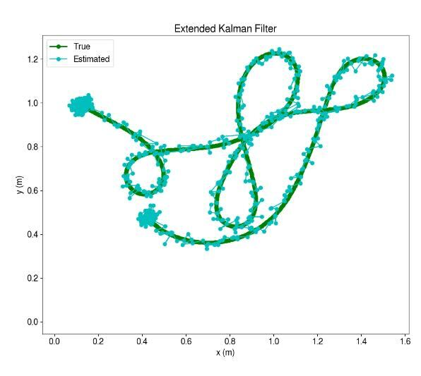
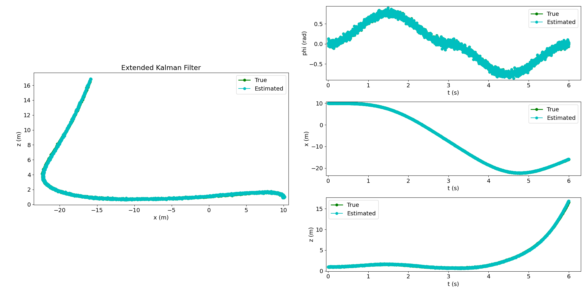

## Extended Kalman Filter working on real-life turtlebot

## Extended Kalman Filter working on simulated planar quadrotor

Unfortunately github markdown does not kindly render my obsidian notes, but I've attatched relevant notes I took to write this code, and the [paper](./EECS_C106B_Project_3__State_Estimation.pdf) I wrote on this for my robotics class

<iframe src="https://drive.google.com/file/d/1cCIHq7tosbyimk_FUnETpTs55S30T8X5/view?usp=sharing&embedded=true" 
width="100%" height="600px"></iframe>
